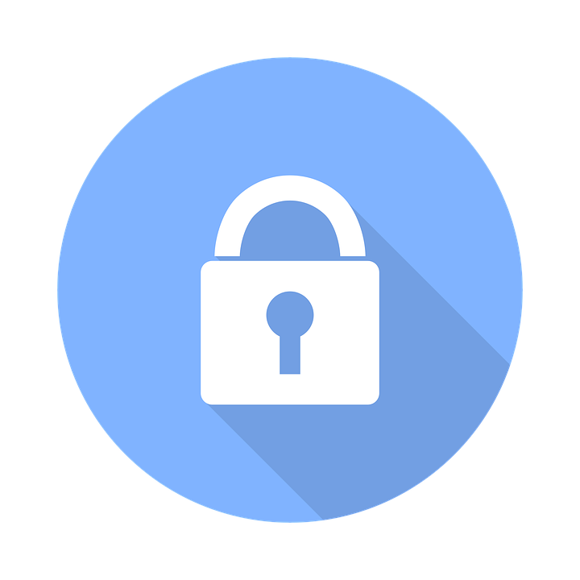
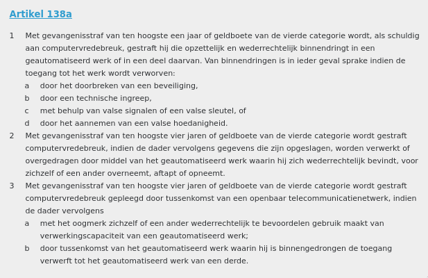
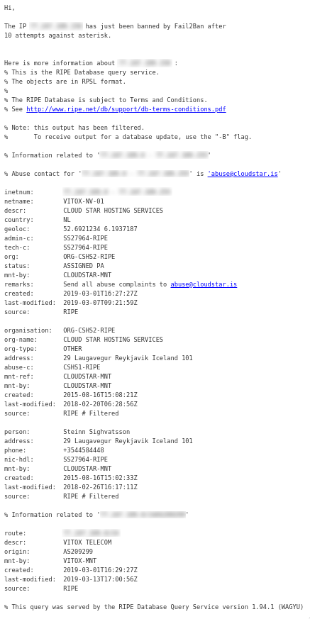
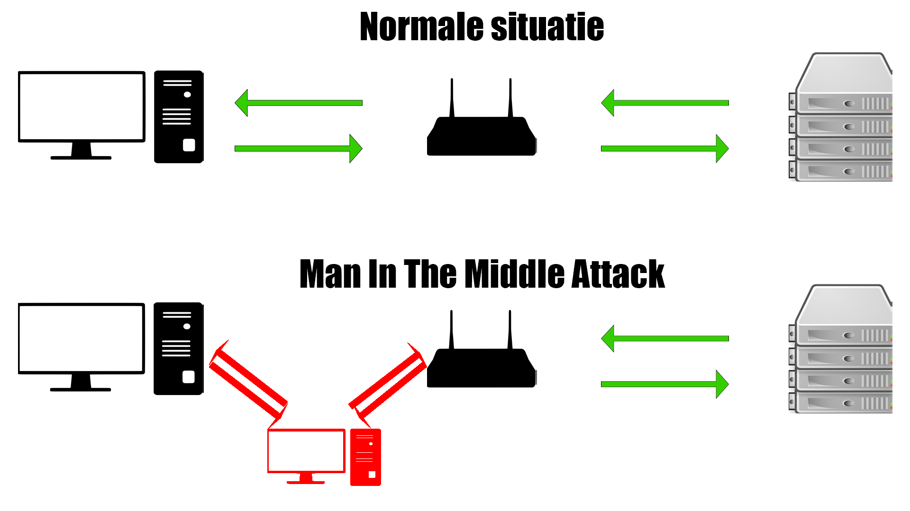
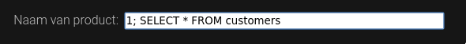
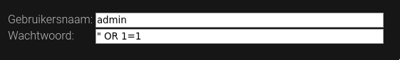

Security
========
[TOC]



“Security is always excessive until it’s not enough.”

Over de module
==============

Wat beheers je aan het eind
---------------------------

Met succesvolle afronding van deze module weet je wat veelgemaakte
beveiligingsfouten zijn en hoe je deze voorkomt. Ook weet je hoe je deze
fouten kunt gebruiken om ongeautoriseerde toegang te verkrijgen tot een
systeem en de ethische implicaties hiervan.

Hoe wordt dat bereikt
---------------------

Het leren van de stof middels deze module is vooral pragmatisch gericht.
Het is de bedoeling dat je veel uitprobeert en buiten de stof om kleine
projecten opzet. Voorbeelden van deze projecten staan aan het begin van
elk hoofdstuk, met verschillende moeilijkheidsgraden.

Als je stof al kent, werk dan vooral niet nog een keer de stof door.
Zorg er wel voor dat je alle oefeningen doorkomt en terugvalt op de stof
als dat niet lukt. Deze module is om je bij te leren, niet om je te
vervelen.

Mocht je meer willen weten dan besproken wordt in deze module, blader
dan naar Appendix A voor links. In het geval van een probleem, kun je
dit bespreken in Microsoft Teams of zelf oplossen met Appendix B.

Opzet materiaal
------

Elk hoofdstuk is aangeduid met een letter ervoor. Een P betekent een
praktisch hoofdstuk met 3 keuze-projecten of meer opgaven aan het eind.
Een T staat voor theoretisch hoofdstuk en zal alleen theorie bevatten.

Kennismaking
============

Met elkaar
-------------------------------

Verzin voor jezelf een slecht wachtwoord (bijvoorbeeld: een huisdier /
school / hobby / ding + je geboortejaar of leeftijd). Ga vervolgens de
groep rond en vraag aan anderen persoonlijke details. Probeer op die
manier elkaars wachtwoord dan te raden.

Met Security
------------

Zou het niet prettig zijn als je je eigen cijfers kon invoeren? Of iets
meer geld op de bank te hebben zonder ervoor te werken? Ik denk dat
iedereen dat wel zou willen, als er geen vervelende consequenties
volgden.

Voor een school zou het betekenen dat diploma’s ongeldig worden
verklaard en voor een bedrijf dat de lonen niet meer betaald zouden
kunnen worden. Niet heel prettig dus om aan die kant te zitten. Daarom
is beveiliging belangrijk, vooral digitale beveiliging tegenwoordig. Zo
kan je bedrijf niet worden aangevallen en de rekening leeggehaald, zo
komen je persoonsgegevens niet op straat en is het diploma die jij in
het examenjaar krijgt van waarde.

Inspirerende personen rond Security
-----------------------------------

|FoxIT                     | Bedrijf die alle beveiliging van de overheid verzorgt.                                                                                                                                                         |
|-------------------------|-----------------------------------------------------------------------------------------------------------------------------------------------------------------------------------------------------|
|Bart Jacobs           | Hoogleraar Cyber Security aan de Radboud Universiteit in Nijmegen.                                                                                                                             |
|Edward Snowden  | Klokkenluider CIA/USA                                                                                                                                                                                                      |
|Georgia Weidman | Heeft *Penetration Testing: A Hands-On Introduction to Hacking* geschreven en geeft vele panels tijdens het Black Hat evenement en SchmooCon. |

Capture the Flag
================

Een capture the flag (CTF) is een met opzet kraakbare server, gemaakt om
gehackt te worden. Bij een CTF worden er zoveel mogelijk vlaggen
verzameld. Hoe meer vlaggen, hoe hoger de score.

Met deze module staat er ook een CTF voor jullie klaar. Deze is te allen
tijde bereikbaar met applicaties die jullie kunnen kraken. Zo kan je de
beveiligingsfouten die worden besproken in deze module meteen toepassen.

De CTF is bereikbaar op: [https://ctf.q-highschool.nl/](https://ctf.q-highschool.nl/)

Als eindopdracht moeten jullie een write-up maken over deze CTF. Dit
houdt in dat je bij elke vlag die je vindt een beschrijving doet hoe je
aan de vlag bent gekomen (eventueel met foto’s of video’s).

De T hoofdstukken hebben geen onderdeel in de CTF, maar hiervoor kan je
alsnog een vlag halen door een quiz goed te beantwoorden op
[https://ctf.q-highschool.nl/quiz/](https://ctf.q-highschool.nl/quiz/). Let op, ook deze applicatie is
kraakbaar. Veel plezier, en hack erop los. Je mag echt alles inzetten. Google, social hacking, brute-force, maakt niet uit wat. Probeer je te verplaatsen in een echte hacker!

Disclaimer en waarschuwing
---------
Je leert in deze seminar hacktechnieken, die je in strafbare situaties kunnen brengen. We vragen je daarom ook met klem om de technieken, die je hier leert alleen op [https://ctf.q-highschool.nl](https://ctf.q-highschool.nl/) te gebruiken!!!!. Ieder ander gebruik van deze technieken kunnen je in serieuze, levensloop bepalende problemen met justitie brengen.
Je mag veel op de geprepareerde server, maar wanneer er een vermoeden is van opzettelijk vernielen van de server of opzettelijk saboteren van het Capture the Flag-game zullen we een onderzoek instellen en niet aarzelen om, indien nodig, maatregelen te nemen.

T: Fundamentals
===============

Verschillende typen hackers
---------------------------

De term “hacker” heeft een heel negatief beeld gekregen in de
samenleving. Dit komt omdat sommige hackers alleen voor eigen gewin gaan
en daarmee anderen beroven. Er is echter ook nog een ander type hacker,
één die wel probeert binnen te komen maar doorgeeft wat er onveilig is.

De hacker die voor eigen gewin gaat en daarmee anderen benadeelt, wordt
een **Black Hat hacker** genoemd. De hacker die beveiligingsfouten
doorgeeft wordt een **White Hat hacker** genoemd. Een White Hat Hacker
die in loondienst werkt, noem je een **Cyber Security Professional**. De
hacker waar je het meest van hoort op het nieuws is de Black Hat.

Een White Hat hacker heeft altijd toestemming van de eigenaar van de
computer waar hij inbreekt. Als een White Hat hacker geen toestemming
heeft, maar wel het lek doorgeeft naderhand wordt hij een **Gray Hat
hacker** genoemd.

Hacken zonder toestemming is altijd illegaal (volgens art. 138a van het
Wetboek v. Strafrecht) en wordt bestraft met maximaal 1 jaar in de
gevangenis of een boete van 20.500€. Soms, als het lek netjes wordt
doorgegeven, wordt het echter door de vingers gezien en wordt er geen
aanklacht gedaan.



Moreel kompas
-------------

Om een goede hacker te zijn heb je ook een goed moreel kompas nodig. Als
je als Black Hat een computer kraakt waar een moord op gepland staat,
zou je dat aangeven bij de politie? Wat als ze vragen hoe je aan dit
bewijs komt? Jij bent immers ook strafbaar voor computervredebreuk. Je staat voor een moreel dilemma

Een goed voorbeeld van een moreel dilemma is de kwestie Edward Snowden. Snowden werkte bij de
CIA en is het gelukt om de NSA (National Security Agency) te kraken. In
2013 werd Snowden aangenomen op freelance basis voor de NSA, waar hij
documenten (staatsgeheimen) bewaarde. Snowden heeft meerdere malen
geprobeerd van binnen de CIA de morele implicaties van sommige operaties
aan te geven, maar niemand luisterde. Op een gegeven moment kon Snowden
er niet meer tegen en vond hij dat hij er wat aan moest doen.

Hij verliet zijn post in Hawaii en vloog naar Hong Kong. Kort daarna
heeft hij aan 3 journalisten de documenten gelekt. Snowden wordt
vervolgd door het Amerikaanse Department of Justice voor spionage en
diefstal van overheidsbezit. Ook hebben ze zijn paspoort ongeldig
verklaard waardoor hij niet meer kan reizen.

Twee dagen hierna is Snowden vertrokken naar Moskou, waar hij meer dan
een maand op het vliegveld heeft ‘gewoond’. De Russische overheid heeft
daarna Snowden asiel geboden met een visum voor 1 jaar. Dit is steeds
verlengd en hij zit nu ergens in Moskou tot 2020 (of langer met nog een
verlenging).

Hacken als filosofie
--------------------

Hoewel de term “hacken” vooral bekend staat als het werkwoord voor
“computerinbraak”, is het eerder een filosofie. Het gaat hier om het
slim omzeilen van limitaties van allerlei soorten computersystemen. Ook is
het de uitdaging om code zo kort en efficiënt mogelijk te schrijven.
Hacken is een manier van doen, niet een werkwoord.

Het aan elkaar plakken van stukken code op een slimme maar onorthodoxe
manier wordt soms ook een hack genoemd en komt ook voort uit deze
filosofie.

Voorbeelden
-----------

Pas als je weet hoe een beveiligingssysteem in elkaar zit en gekraakt
kan worden, kan je jezelf er tegen wapenen.

De eigenaar van een website kan zo op meerdere manieren getroffen
worden. Hack pogingen gebeuren veel vaker dan je zou denken, zelfs al is
je site onbekend. Als een site de beveiliging goed op orde Wanneer er 10
foute inlogpogingen gedaan worden wordt het IP-adres toegang ontzegd
voor 24 uur. Hieronder staat de log melding van de beveiligingssoftware.



In de log melding is ook direct te zien wie je moet bereiken voor een
Abuse melding. Een abuse melding is een serieuze melding dat een
IP-adres zich niet gedraagt online, waarop de internet service provider
(ISP) in contact gaat met de overtreder. Dit is zeker geen lichte
melding en wordt heel serieus genomen.

T: Networking
=============

De basis
--------

Wanneer je contact legt met een andere computer, gaat dat over een
netwerk. Een netwerk bestaat uit meerdere computers en een manier van
communicatie tussen deze computers.

Sommige computers zijn servers. Dit type computer levert services aan de
rest van het netwerk. Denk hierbij aan websites, game servers, etc.
Andere zijn routers, deze zorgen ervoor dat de computers elkaar kunnen
bereiken. De grootste groep is echter ‘normale’ computers. Deze noemen
we **clients**. Alle apparaten aangesloten op het netwerk hebben een IP
adres. Dit is een identificatie die je krijgt van je router. Dit ip
wordt meegestuurd in elk bericht wat je doet over het netwerk.

De router thuis is een samensmelting van drie aparte apparaten:

-   Een Router, die het verkeer stuurt naar waar het moet gaan. Deze
    ontvangt data van de pc’s, stuurt het door naar de volgende
    apparaten in het netwerk (bijvoorbeeld een website) en ontvangt de
    data terug van de website. Daarna stuurt hij het terug naar de pc.

-   Een Access Point, die het internet van een kabel naar radiogolven
    omzet. Hiermee heb je wifi zodat je apparaten draadloos ook internet
    hebben.

-   Een firewall, die het thuisnetwerk beschermt en afschermt. Dit zorgt
    ervoor dat alle verbindingen van buitenaf gestopt worden, tenzij ze
    zijn toegestaan binnen de firewall. Het toestaan van deze
    verbindingen wordt port forwarding genoemd.

De routers die verder worden genoemd in deze module, wordt niet de hele
samensmelting mee bedoeld, maar alleen het eerste onderdeel.

In de oudere versie van het internet (maar nog steeds het meest
gebruikt), ipv4, zijn de routers het meest prominent. Dat komt omdat
elke pc verbonden met het internet, eerst langs een of meerdere routers
moet. Op het internet kunnen PC’s elkaar dus niet direct bereiken. Met
de nieuwere versie, ipv6, heeft elke pc een directe verbinding met een
andere. Er zijn geen blokkades of firewalls meer, anders dan die op de
pc geïnstalleerd.

Een manier om ipv4 te visualiseren is om het te vergelijken met een
buurt. In een buurt staan huizen en winkels. Alle gebouwen hebben een
adres waarop pakketjes bezorgd kunnen worden. De hoofdbewoner van het
huis ontvangt pakketjes en verdeelt ze onder de bewoners. Wanneer een
bezorger een adres niet kan vinden, kan hij het vragen aan iemand die
hem doorverwijst (een ‘router’). De winkels leveren diensten aan de
buurt en aan mensen van buiten de buurt.

Met ipv6, is de visualisatie hetzelfde. Alleen nu hebben de gebouwen
geen adres, maar de mensen zelf een apart adres. Zo hebben bewoners van
hetzelfde gebouw hetzelfde begin van het adres, maar elk een apart
gedeelte aan het eind.

Communicatie
------------

De manier van communicatie in een netwerk gebeurd met een ‘protocol’.
Een protocol is simpelweg een set van regels. Deze regels worden
aangehouden om een standaard manier van communicatie te hebben. Zie een
protocol als de grammatica van een taal: er is een vaste zinsopbouw en
vervoeging van woorden.

De hoofd protocollen waar vele andere op gebaseerd zijn, zijn TCP
(Transmission Control Protocol) en UDP (User Datagram Protocol). TCP
checkt dat elk bericht netjes is ontvangen en begint de communicatie met
een driedelige ‘handdruk’. Deze handdruk bevat informatie over de
connectie tussen de twee computers waarop de daarna volgende berichten
worden aangepast. Een handdruk is een proces waarbij twee apparaten
overleggen hoe de verdere communicatie plaats zal vinden.

De TCP handdruk gaat met drie berichten, SYN-SYN/ACK-ACK. Dit staat voor
‘Synchronize’, ‘Acknowledge Synchronize’ en ‘Acknowledge Acknowledged’.
Dus het synchronizatieverzoek wordt bevestigd en de bevestiging wordt
ook bevestigd. Daarmee is een verbinding gelegd. Als deze handshake niet
succesvol wordt uitgevoerd, begint er geen data transmission en is er
dus geen sprake van een verbinding.

MAC-adressen
------------

Zonder dat een apparaat een IP-adres heeft, kan er geen communicatie mee
zijn. Een router geeft een IP-adres aan een apparaat, maar hoe kan dit
zonder dat de router via bijvoorbeeld TCP of UDP met het andere apparaat
kan praten?

Dit gebeurt door middel van MAC-adressen. MAC staat voor Media Access
Control en doet precies waar de naam voor staat. Wanneer een computer
een IP-adres van de router wil ontvangen, doet deze een verzoek met het
DHCP-protocol. Hierbij stuurt de computer een MAC-adres mee, zodat de
router weet waar het bericht naar verzonden moet worden. Dit verzoek
gaat naar alle apparaten die verbonden zijn met dezelfde kabel of
hetzelfde wifi netwerk. Zonder dat een MAC-adres meegezonden wordt, is
er dus volledige chaos en weet geen enkel apparaat voor wie welk bericht
bedoeld is. Een verzoek dat wordt verzonden op het hele netwerk noem je
een **broadcast message**.

De router die ontvangt vervolgens het verzoek en stuurt terug welk
IP-adres de computer krijgt. Om ervoor te zorgen dat niet elk ander
apparaat dit ontvangt en ‘verward’ raakt, stuurt de router het MAC-adres
mee van de ontvanger en van zichzelf. Zo weet het apparaat op welk
MAC-adres de router bereikt kan worden en de router waar het verkeer
naar toe moet voor het apparaat.

T: OSI Model
============

Voorkennis: Networking

Het OSI-model is een manier van abstractie waardoor problemen in een
netwerkomgeving gemakkelijker te achterhalen zijn. Een laag in het model
geeft functie aan de laag erboven en krijgt functie door de laag
eronder. Er zijn 7 lagen zoals beschreven in ISO 7498-1. (International
Standardisation Organisation, de organisatie die alle standaarden
noteert en bewaart onder een ISO-nummer)

Waarom is dit nuttig?
---------------------

Wanneer er problemen zijn met een netwerk, kan het soms heel moeilijk
zijn om te weten waar deze problemen liggen. Ook wanneer je een
programma met netwerkfunctionaliteit schrijft, is het erg lastig te
achterhalen waar een fout kan zitten. Als netwerkbeheerder is het
essentieel om de functie juist te kunnen uitvoeren en systeembeheerders
kunnen met hulp van dit model zorgen dat de wifi altijd werkt.

Dit is ook niet uitsluitend voor netwerken, dit model kan toegepast
worden op elke vorm van digitale communicatie van apparaten onderling.

Wanneer je kennis hebt van dit model maakt het ook het hacken
makkelijker, aangezien je een netwerk op 7 lagen kan kraken.

Wat zijn de lagen?
------------------

De lagen worden hier beschreven van hoog naar laag, waardoor je een
beter begrip krijgt van de hardware erachter.

### Laag 7: Application

Deze laag zit het dichtst bij de gebruiker. Elk programma dat
netwerkfunctionaliteit aanbiedt zit in deze laag (bijv. Chrome en
Firefox). Alle vormen van serversoftware zitten bijvoorbeeld ook in deze
laag. De API’s zijn high-level, wat betekent dat er met relatief simpel
te begrijpen en weinig regels code heel veel op hardware niveau gedaan
wordt.

### Laag 6: Presentation

Deze laag is de brug tussen data op netwerkniveau en applicatieniveau.
Zo zet deze laag het verzoek om een website te bezoeken om in een echt
verzoek wat naar de webserver gaat en te begrijpen is voor de website.

Cryptografie zit ook in deze laag, de data wordt versleuteld
‘gepresenteerd’ aan een ander apparaat en daar in laag 6 weer omgezet in
data die de Application layer begrijpt.

### Laag 5: Session

Elk apparaat dat wil spreken met een ander, moet eerst een band leggen.
Dit wordt een session genoemd en alles wat te maken heeft met zo’n band
gebeurt in deze laag. Zo wordt er hier overlegd tussen apparaten hoe
lang ze wachten op communicatie van elkaar.

### Laag 4: Transport

Om een band tussen apparaten te kunnen leggen, moet er al een vorm van
communicatie zijn. Ook om überhaupt te kunnen praten met andere
apparaten moet er een ‘taal’ zijn die gesproken wordt. De meest bekende
vorm van zo’n transportsysteem is TCP (Transmission Control Protocol),
die gebouwd is op het IP (Internet Protocol). Samen worden ze TCP/IP
genoemd. TCP en UDP poorten werken op laag 4, ip adressen op laag 3.

### Laag 3: Netwerk

In de netwerklaag zit de meeste routerfunctionaliteit. Deze is
verantwoordelijk voor het rondsturen van pakketten. Wanneer een apparaat
in Europa wil praten met een ander apparaat in Amerika, gaat dit verkeer
eerst door heel veel routers er tussenin. Er zijn soms wel duizenden
andere apparaten waar het verkeer eerst doorheen gaat voordat het zijn
bestemming bereikt. Dit is ook de laag waar een apparaat een eigen adres
krijgt om verkeer op te ontvangen. Netwerkengineers vinden dit de meest
interessante laag.

### Laag 2: Data Link

De data link-laag zorgt voor directe communicatie tussen twee apparaten,
maar zorgt ook voor de foutcorrectie van laag 1. Er zijn hier twee
sublagen, namelijk de MAC (Media Access Control) laag en de LLC (Logical
Link Control) laag. De meeste switches werken op deze laag. Een switch
is netwerkapparatuur dat van een ethernetpoort meerdere maakt. Zo kunnen
er grote en gecompliceerde netwerkstructuren gemaakt worden, terwijl er
maar een kabel naar de centrale router toe gaat.

### Laag 1: Physical

Dit is het rauwste van het rauwste. De aller diepste laag zorgt voor de
fysieke transport van de data. Dat kan bijvoorbeeld over radiogolven
gaan, of 802.11 draadloos signaal, of een internet kabel. Elke vorm van
digitale communicatie wordt op een manier verzonden en is de
verantwoordelijkheid van deze laag. Meestal wanneer er een probleem is
in een netwerk, wordt deze laag als eerste bekeken. “Heb ik de internet
kabel er wel goed in zitten?” of “Ben ik wel verbonden met wifi?” zijn
de vragen die hier perfect bij passen.

Hoe onthoud ik dit?
-------------------

De zin *“A Penguin Said That Nobody Drinks Pepsi”* vergeet je nooit meer
en bevat alle eerste letters van het model. *“A Priest Saw Two Nuns
Doing Pushups”* is ook een zin die hier gebruikt kan worden.

T: Security goals
=================

Om beveiliging wat doelgerichter te maken zijn er Security Goals
ontworpen. Dit zorgt voor een vaste scheiding tussen bepaalde
beveiligingsstappen en helpt ook met het abstract maken van digitale
beveiliging.

Om dit makkelijker uit te leggen spreken we over Anna, Bob en Peter.
Anna en Bob sturen brieven met een beveiliging terwijl Peter ertussen
probeert te komen. De doelen zijn als volgt:

-   _Confidentiality_ (vertrouwelijkheid): Peter kan niet lezen wat Anna
    en Bob naar elkaar sturen.

-   _Integrity_ (integriteit): Peter kan niet aanpassen wat er
    gecommuniceerd wordt, zonder dat Anna en Bob dit merken.

-   _Authenticity_ (authenticiteit): Anna en Bob zijn zeker van elkaars
    identiteit. Anna praat dus niet met Peter terwijl ze denkt dat ze
    met Bob praat.

-   _Availability_ (beschikbaarheid): Peter kan niet voorkomen dat Anna en
    Bob communiceren.

-   _Non-Repudiation_ (duidelijkheid): Anna en Bob kunnen geen van beide
    ontkennen wat er gestuurd is.

-   _Accountability_ (toerekenbaarheid): Er is een geschiedenis van
    communicatie van alle partijen (dus ook Peter’s pogingen)

Naast deze beveiligingsdoelen zijn er ook scheidingen tussen beveiliging
en veiligheid (Security vs Safety). Beveiliging gaat over het beschermen
tegen een actieve aanvaller dat een computersysteem wil ondermijnen
terwijl veiligheid gaat over de bescherming tegen ongewenste errors of
ongelukken.

Ook is er een scheiding tussen de verschillende typen maatregelen. Zo is
er sprake van de volgende 3 maatregelen die genomen worden om een
systeem veilig te houden:

-   Technische maatregelen, zoals wachtwoorden, twee-factorauthenticatie
    en tamper-proof hardware (zorgen dat een pc niet ongewenst
    opengemaakt kan worden of gereset).

-   Organisatorische maatregelen, zoals inlichten van medewerkers,
    protocollen voor thuiswerken en veilig opruimen van oude hardware
    (dus schijven eerst helemaal leegmaken voordat ze worden
    doorverkocht of verwoest).

-   Wettelijke maatregelen, zoals Artikel 138a van het Wetboek v.
    Strafrecht en ‘Terms of Service’ van een bedrijf / website.

Websites en andere digitaal aanwezige diensten van bedrijven moeten
altijd een sterk plan hebben als verdediging tegen aanvallen van zowel
binnen als buiten het bedrijf. Daarom is het belangrijk om als bedrijf,
al deze punten te verwerken in een beveiligingsplan en een ‘crisis’ plan
achter de hand te houden.

P: Netwerken en Sniffen
=======================

Voorkennis: Networking

Sniffen
-------

De veiligheid van de in ‘Networking’ beschreven buurt is gebaseerd op
vertrouwen. Als er een pakketje wordt bezorgd, wordt er vanuit gegaan
dat dit niet geopend wordt, anders dan door de persoon voor wie het
bestemd is. Er zijn echter altijd mensen die de nieuwsgierigheid niet
kunnen remmen en het pakketje openen voordat jij het zelf doet.

Het bekijken van netwerkverkeer, zonder dat het voor jou bestemd is,
wordt sniffen genoemd. Net als dat je in het echt geen pakketjes van
anderen mag openen, mag dat online ook niet. Dit is dan ook een misdrijf
en zeer strafbaar.

Sniffen is niet mogelijk zonder dat je een router bent. Je moet het
verkeer eerst binnenkrijgen om het te kunnen lezen. Een goede sniffer
zorgt ervoor, dat geen van beide partijen (website en client) weet dat
de data onderschept wordt. Een voorbeeld van een sniffing programma is
Wireshark, dit is tevens het meest bekende programma. Het logo staat
hieronder, misschien heb je die ooit al eens gezien.


Sniffen tegengaan
-----------------

Om sniffen tegen te gaan is er TLS (Transport Layer Security). Dit kan
je zien aan het groene slot bovenin je browser. Hierbij heeft de server
een public key en een private key, maar ook de client. De public key kan
alleen data versleutelen, deze kan dus nooit versleutelde data zichtbaar
maken. De private key kan dit wel. De client versleutelt de data voordat
het verzonden wordt, de data komt versleuteld aan bij de router (die het
niet kan ontsleutelen tenzij hij in bezit is van de private key) en komt
vervolgens veilig aan bij de webserver, waar het zichtbaar gemaakt wordt
en behandeld. De server versleutelt de data dan met de public key van de
client, en zendt het terug. Kijk ook eens naar de module ‘Cryptografie’
als je meer wilt leren over de verschillende sleutels.

Man in the middle
-----------------

Als aanvaller heb je meestal geen toegang tot een centrale router
waarvan je het netwerkverkeer wil sniffen. Om dat op te lossen is de
MITM (Man In The Middle) aanval ontworpen. Hierbij heb je de
‘aanvallende’ computer die constant naar de gebruiker stuurt dat het de
router is, en aan de router dat het de gebruiker is. Als dit succesvol
is, stuurt de gebruiker de data naar de aanvaller, die het vervolgens
doorstuurt naar de echte router en andersom. Nu kan de aanvaller dus WEL
het verkeer onderscheppen en lezen, zonder dat beide partijen dit weten.
TLS beveiliging gaat een MITM aanval ook tegen en maakt dit praktisch
onmogelijk.



Zelf sniffen
---------------------------------

Download en installeer Wireshark op [https://www.wireshark.org/download.html](https://www.wireshark.org/download.html) met de standaardinstellingen.
Download de capture-file op [https://ctf.q-highschool.nl/capture.pcap](https://ctf.q-highschool.nl/capture.pcap)
en open hem met Wireshark. Zoek in dit bestand de vlag.

P: Port scanning
================

Ports
-----

Wanneer een server op een netwerk een service aanbiedt, draait deze
service op een port. Zie een port als een huisnummer in een straat. Je
wil communiceren met die ene persoon die op dat huisnummer woont.
Wanneer er een verbinding tussen apparaten wordt gelegd gebeurd dit
altijd over een port.

De meest bekende ports op TCP zijn:

|80  |HTTP (Webserver, levert web pagina’s)|
|-----|----------------------------------------------------|
|443|HTTPS (Webserver, maar dan met TLS encryptie)|
|22|SSH (Serverbeheer op afstand met een remote shell)|
|21|FTP (Filesharing)|
|993|IMAP (Om mail op te ontvangen)|
|587|SMTP (Om beveiligd mail op te versturen)|

Port scanner
------------

Als security professional wil je natuurlijk weten welke ports er open
staan en dus welke services een server levert. Om hier snel achter te
komen zijn er port scanners. Deze verbinden op elke mogelijke port om
erachter te komen of deze een service open heeft.

Er zijn verschillende typen port scan, deze verbinden op verschillende
manieren met de poorten. Sommige van deze typen port scan zijn te
detecteren door een firewall en dus ook af te weren. Andere types zijn
onherkenbaar voor een firewall, maar deze zijn ook minder nauwkeurig in
het detecteren welke service er draait.

Een voorbeeld van een port scanner is [https://www.advanced-port-scanner.com/](https://www.advanced-port-scanner.com/)
Deze kan je downloaden en uitproberen op je eigen netwerk tegen bijvoorbeeld 
het IP-adres van je router.

Port scannen van een willekeurige computer op het inter wordt als een offensieve actie beschouwd. Dit is het computer-equivalent van bij alle deuren van de straat kijken welke open staat. Dit levert je een mogelijke aanklacht van huisvredebreuk of in dit geval computervredebreuk op.

Je mag voor deze module wel port scannen op [https://ctf.q-highschool.nl/](https://ctf.q-highschool.nl/).

Directory fuzzing
---
Wanneer je eenmaal een HTTP(S)-server gevonden hebt op een poort, kan het interessant zijn om te kijken welke mappen en bestanden toegankelijk zijn. Zelden is het mogelijk om een directory-listing te bekijken. Om toch uit te kunnen vinden welke mappen en bestanden op de server toe- gankelijk zijn is het mogelijk om een zogenaamde _directory fuzzer_ in te zetten. Dit is een programma wat systematisch allerlei mogelijkheden nagaat. Hierbij wordt gebruik gemaakt van vaak gebruikte map- en bestandsnamen. Een zogenaamde brute-force aanval is ook mogelijk. Het voordeel van de brute-force is dat dit zo’n beetje alle mappen en bestanden bloot kan leggen. Nadeel is dat het erg lang duurt (mogelijk zelfs enkele dagen). Dus je zult hier een afweging moeten maken.
De termen die voor deze technologie gebruikt worden zijn _directory fuzzing_ en _URL fuzzing_. De term fuzzing omvat meer dan alleen het vinden van bestanden in een webserver, dat is misschien wel handig om te weten.

Een voorbeeld van een al wat oudere maar nog steeds populaire directory fuzzer is [DirBuster](https://sourceforge.net/projects/dirbuster/). Het programma wordt geleverd met een aantal woordenlijsten met de meeste gebruikte map- en bestandsnamen. Met een kleinere lijst is het programma sneller klaar met het uitproberen van alle mogelijkheden, maar is de kans ook groter dat je interessante pagina's mist omdat die niet in de lijst zaten. Als de `small` lijst van DirBuster je al te lang duurt, kun je ook [deze `tiny` lijst](directory-list-lowercase-2.3-tiny.txt) gebruiken om mee te spelen. Bedenk ook goed in welk type bestanden je geïnteresseerd bent, in welke map die staan, of je ook geïnteresseerd bent in submappen (*recursive* zoeken) en of je op zoek bent naar mappen, bestanden of allebei. De juiste opties aanvinken kan een hoop tijd schelen.

P: SQL Injection
================

Basis SQL
---------

Met voorkennis van SQL, MySQL, SQLite of andere SQL varianten kan je dit
overslaan

SQL is een taal die gebruikt wordt om te communiceren met een database.
Hier wordt veel dieper op ingegaan tijdens de module *Databases*, maar
wordt nu een kleine basis van gegeven. SQL lijkt ontzettend op Engels en
is daarom relatief makkelijk om te leren.

De beste sites om de basis van SQL mee te leren zijn:
1. [https://www.codecademy.com/learn/learn-sql](https://www.codecademy.com/learn/learn-sql)
1. [https://www.w3schools.com/sql/](https://www.w3schools.com/sql/)

Vroeger bestonden er geen frameworks om databases abstracter te maken
(meer high-level). Alles werd destijds handmatig gedaan met (meestal)
PHP en semi-hardcoded (een deel voorgeschreven code wat aangevuld wordt
met de gegevens die een gebruiker invult) SQL statements. Dit zorgt
ervoor dat wanneer er geen input sanitation (het schoonmaken van de
invoer van de gebruiker) is, een hacker zelf een SQL statement kan
meesturen.

Met input sanitation zorgt een programmeur dat de gegevens die een
gebruiker meesturen ook juiste gegevens zijn. Zo voorkomt de programmeur
een crash in zijn programma, of ongewenste bijwerkingen. Bijvoorbeeld
een stuk text meesturen wanneer er om een nummer gevraagd wordt zou dan
afgevangen worden.

Een voorbeeld hiervan is het opvragen van gegevens in een magazijn. Zo
kan een gebruiker zoeken op basis van een item_name wat in het magazijn
zit:

```sql
SELECT item_id, item_name, item_count
FROM stock
WHERE item_id = $userItemID;
```

Omdat een puntkomma de query afsluit en ook direct mogelijkheid geeft om
andere queries te doen, kan een hacker ook andere gegevens opvragen.
Zoals bijvoorbeeld klantgegevens van anderen. Als de hacker zoekt naar
het volgende artikel, krijgt hij de klantgegevens te zien:



Dit komt omdat nu de volgende query wordt verzonden:

```sql
SELECT item_id, item_name, item_count
FROM stock
WHERE item_name=1; SELECT * FROM customers;
```

De hacker krijgt dan het artikel met item_id=1 te zien, maar ook het
hele klantenbestand.

Ook kan een hacker inloggen op elk account met deze manier. Als de
hacker in een inlogform het volgende zou invullen en de authentication
niet goed gedaan is, logt hij in met alleen een gebruikersnaam:



Hierbij is de SQL als volgt geprogrammeerd:

```sql
SELECT user_id
FROM users
WHERE username='$username'
   AND password='$password';
```

Hierdoor wordt het met de injectie:

```sql
SELECT user_id
FROM users
WHERE username='admin'
   AND password=''
    OR 1=1;
```

Geen wachtwoord meer nodig dus, aangezien 1 altijd gelijk staat aan 1 en
er geen andere vorm van login verificatie is. Makkelijk binnenkomen.

Zelf SQL injection toepassen
-------------------------------------------------

Het YouTube kanaal ComputerPhile heeft een mooie instructie staan, hoe een SQL-injection in elkaar te zetten is.

Je kan ook meteen los gaan op de CTF die open staat op [https://ctf.q-highschool.nl/search](https://ctf.q-highschool.nl/search)

P: Cross-site scripting
=======================

Basis Javascript
----------------

Met voorkennis van Javascript kan je dit overslaan

Javascript is een taal die vooral wordt gebruikt in web development. Het
is een stuk code die in de browser van de client zelf runt. Zo kan je
web apps bouwen die efficiënter zijn omdat de server niet alles hoeft te
berekenen maar je een groot gedeelte af kan staan aan de clients zelf.
Tegenwoordig is Javascript niet meer weg te denken en is een van de
grootste programmeertalen in de wereld.

Javascript kan je leren op:

1. [https://www.codecademy.com/learn/introduction-to-javascript](https://www.codecademy.com/learn/introduction-to-javascript)
1. [https://www.w3schools.com/js/](https://www.w3schools.com/js/)
1. [https://en.wikibooks.org/wiki/JavaScript](https://en.wikibooks.org/wiki/JavaScript)

Javascript wordt op een website vaak geladen met een `<script>`
tag, maar kan ook op andere manieren geladen worden door bijvoorbeeld
een image of button tag.

Wat is cross-site scripting?
----------------------------

Omdat Javascript als HTML element geplaatst kan worden, kan er op
plekken waar de gebruiker een bericht kan achterlaten HTML meegestuurd
worden met het bericht. Zo ook, de script tag. Telkens wanneer dit
bericht gezien wordt door anderen, wordt er dus code uitgevoerd op dat
apparaat.

Een goed voorbeeld hiervan is de Self-Retweeting Tweet. Dit was een
simpele Tweet die er heel onschuldig uitzag, maar er was veel meer aan
de hand.

```html
<script class="xss">
    $('.xss').parents().eq(1).find('a').eq(1).click();
    $('[data-action=retweet]').click();
    alert('XSS in Tweetdeck');
</script>How are you doing?
```

Voor een persoon die deze Tweet zonder inspecteer element bekijkt, is
alleen de “How are you doing?” te zien. Maar, zonder dat de persoon er
zelf op geklikt heeft, is de Tweet al geretweet.

De code werkt als volgt:

1.  Een `script` tag met de styling class `‘xss’` wordt gemaakt.

2.  De tag boven de script tag, dus die van de Tweet, wordt geselecteerd
    met jQuery.

3.  Vervolgens wordt er in de DOM gezocht naar een `a` element die een
    `data-action=retweet` heeft.

4.  Daar wordt `.click()` op uitgevoerd en de Tweet is geretweet.

Als je meer wilt weten over deze tweet dan is er hier een video van Tom
Scott: [https://www.youtube.com/watch?v=zv0kZKC6GAM](https://www.youtube.com/watch?v=zv0kZKC6GAM)

Het gevaar
----------

Dit lijkt heel onschuldig, maar XSS kan hele serieuze gevolgen hebben.
Telkens wanneer je inlogt op een website krijg je een cookie. Deze
cookie zegt dat jij bent ingelogd en hoe lang dat nog geldig is voordat
je opnieuw moet inloggen. Deze cookies zijn alleen ook te zien met
Javascript. Zo kunnen je persoonlijke gegevens dus in gevaar komen.

Ook kan er met Javascript een websocket connectie gemaakt worden,
waardoor er data kan worden verzonden naar een andere computer.

Als iemand kwaad zou willen, kan er dus een stuk script geschreven
worden waardoor je cookies worden opgeslagen in een variabele om
vervolgens verzonden te worden naar een aanvaller. Deze aanvaller kan
dan alles met jouw account alles wat jij ook kan, totdat de sessie
verloopt. Dit kan bij banken catastrofaal zijn.

Zelf XSS toepassen
---------------------------------------

Op de volgende site krijg je 6 puzzels die je moet oplossen door XSS toe
te passen. Je kan direct om hints vragen of de code zien die ze
verwachten. [https://xss-game.appspot.com/level1](https://xss-game.appspot.com/level1)

Ook kan je natuurlijk een berichtje achterlaten op het blog van de CTF: [https://ctf.q-highschool.nl/blog](https://ctf.q-highschool.nl/blog)

Eindopdracht
=================================

De eindopdracht voor deze module is het inleveren van een verslag met de
vlaggen die je hebt gevonden en hoe je ze gevonden hebt. Kijk in Teams voor de precieze voorwaarden en deadline voor het inleveren van je verslag.

Wanneer je een vlag gevonden hebt, kun je deze invoeren bij een andere website, een Capture The Flag gameserver. Kijk in de studiewijzer op teams voor de url naar deze server. Je cijfer voor deze module wordt bepaald door je behaalde score bij het Capture The Flag-game te delen door 10.

De server waar je de vlaggen kan vinden: [https://ctf.q-highschool.nl/](https://ctf.q-highschool.nl/)

Appendix A
==========

Aanvulling op de normale stof
-----------------------------

### Fundamentals:

-   Text: [https://geekflare.com/understanding-cybersecurity/](https://geekflare.com/understanding-cybersecurity/)
-   Video: [https://www.youtube.com/watch?v=63aQUqYoV9A](https://geekflare.com/understanding-cybersecurity/)

### Networking:

-   Video series: [https://www.youtube.com/watch?v=cNwEVYkx2Kk&list=PLDQaRcbiSnqF5U8ffMgZzS7fq1rHUI3Q8](https://www.youtube.com/watch?v=cNwEVYkx2Kk&list=PLDQaRcbiSnqF5U8ffMgZzS7fq1rHUI3Q8)

### OSI Model:

-   Text: [https://www.lifewire.com/layers-of-the-osi-model-illustrated-818017](https://www.lifewire.com/layers-of-the-osi-model-illustrated-818017)
-   Video : [https://www.youtube.com/watch?v=vv4y_uOneC0](https://www.youtube.com/watch?v=vv4y_uOneC0)

### Sniffing:

-   Text: [https://www.vice.com/en_us/article/jpgmxp/how-to-go-from-0-to-sniffing-packets-in-10-minutes](https://www.vice.com/en_us/article/jpgmxp/how-to-go-from-0-to-sniffing-packets-in-10-minutes)
-   Video: [https://www.youtube.com/watch?v=9EF44RXD5v0](https://www.youtube.com/watch?v=9EF44RXD5v0)

### Ports:

-   Text: [http://www.steves-internet-guide.com/tcpip-ports-sockets/](http://www.steves-internet-guide.com/tcpip-ports-sockets/)

### SQL Injection:

-   Text: [https://www.w3schools.com/sql/sql_injection.asp](https://www.w3schools.com/sql/sql_injection.asp)
-   Video: [https://www.youtube.com/watch?v=ciNHn38EyRc](https://www.youtube.com/watch?v=ciNHn38EyRc)

### Cross-site scripting:

-   Text: [https://www.imperva.com/learn/application-security/cross-site-scripting-xss-attacks/](https://www.imperva.com/learn/application-security/cross-site-scripting-xss-attacks/)
-   Video: [https://www.youtube.com/watch?v=L5l9lSnNMxg](https://www.youtube.com/watch?v=L5l9lSnNMxg)

### Cryptografie:

-   Video (Public key Crypto): [https://www.youtube.com/watch?v=GSIDS_lvRv4](https://www.youtube.com/watch?v=GSIDS_lvRv4)
-   Video (Diffie Hellman): [https://www.youtube.com/watch?v=NmM9HA2MQGI](https://www.youtube.com/watch?v=NmM9HA2MQGI)
-   Text: [https://thebestvpn.com/cryptography/](https://thebestvpn.com/cryptography/)

Appendix B
------------------

-   [https://www.youtube.com/user/Computerphile](https://www.youtube.com/user/Computerphile)
-   [https://null-byte.wonderhowto.com/](https://null-byte.wonderhowto.com/)
-   [https://security.stackexchange.com/](https://security.stackexchange.com/)