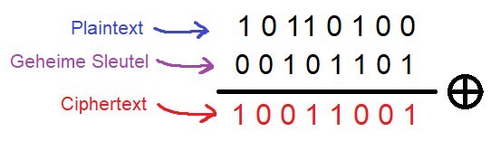

Cryptografie
===============

Wat is cryptografie?
---------------------
Cryptografie is een overkoepelende term die je veel voor
ziet komen in theoretische cybersecurity, en bestaat vooral
uit wiskunde. Een thema in cryptografie is veilige data-overdracht.

Veilige data-overdracht gaat over het overdragen van berichten tussen 
twee punten (bijvoorbeeld twee personen), zonder dat iemand voor wie 
het bericht niet bedoeld was de inhoud ervan kan lezen.
Het versleutelen van berichten op deze manier heet encryptie.

Praktische voorbeelden van encryptie
-------------------------------------
Je hebt misschien vroeger wel eens samen met een vriend of
vriendin een codetaal bedacht om berichten naar elkaar te 
sturen in de klas zonder dat de juf of meester wist wat er 
stond. Misschien was je codetaal om elk letter in het alfabet
met 4 plekken te verschuiven, dus een 'a' wordt een 'e', een 'b' 
wordt een 'f' etc. 

Als dit zo was, moet ik je helaas vertellen dat je niet de eerste 
persoon bent die hier mee kwam, want deze vorm van encryptie werd 
rond 50 BC (!) al gebruikt door Julius Caesar, en waarschijnlijk 
voor die tijd ook al. Dit encryptieschema heet het [caesarcijfer][https://nl.wikipedia.org/wiki/Caesarcijfer]
(Caesar cipher in het Engels), en vandaag de dag wordt het ook 
[ROT][https://nl.wikipedia.org/wiki/Rot13] genoemd.

Een ander voorbeeld is de one-time pad. De one-time pad 
werd tijdens de Tweede Wereldoorlog gebruikt door spionnen 
om berichten te versleutelen. De One-time pad bestaat uit 
je bericht, ook wel de "Plaintext" genoemd, en een "Geheime 
Sleutel" die alleen jij en de persoon naar wie je het bericht
wilt sturen weten. 

Er zijn twee versies van de one-time pad,
eentje met cijfers waarbij het cijfer de positie van het getal
in het alfabet aangeeft (Dus een A is een 1, B is een 2 etc.),
en een versie waar bits gebruikt worden. In dat laatste geval zijn 
beide de plaintext en de sleutel in bits, dus eentjes of 
nulletjes. Dit betekent dus dat als je een bericht hebt met 
letters, je het eerst om moet zetten naar bits. Het versleutelen
in de versie met bits ziet er als volgt uit:

Hier worden de plaintext en sleutel bit voor bit bij elkaar 
"opgeteld". Het optellen gaat per kolom (dus naar beneden), 
en optellen met bits werkt zo:

- 1 + 1 = 0
- 1 + 0 = 1
- 0 + 1 = 1
- 0 + 0 = 0

Het resultaat heet de "Ciphertext". Deze ciphertext is een 
stuk onzin, en het betekent helemaal niks voor iemand die de 
sleutel niet heeft, maar iemand die hem wel heeft kan de 
plaintext weer uitrekenen door de ciphertext en de sleutel 
bij elkaar op te tellen. Probeer dit voor jezelf met de 
ciphertext en sleutel uit het voorbeeld hierboven. Als alles 
goed gegaan is, zou je de plaintext weer voor je moeten hebben. 
De bits worden vervolgens weer omgezet naar letters.

Slechte encryptie
-----------------
Het caesarcijfer wordt gezien als een slechte vorm van encryptie. 
Dit betekent dat een bericht dat versleuteld wordt met het 
caesarcijfer vaak makkelijk en snel gekraakt kan worden, dus 
zonder dat je weet hoeveel plekken je elke letter in het alfabet 
verschuift. Probeer voor jezelf of je deze ciphertext kan kraken: 
xopnozjovvs. 

Links
------
Bekijk het stukje over optellen bij de one-time pad in deze video:
- [Optellen bij het OTP][https://www.youtube.com/watch?v=cpqwp2H0SNo&t=287s]