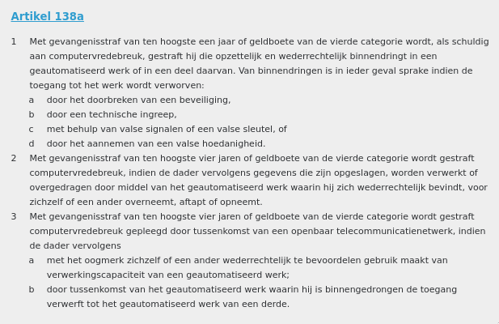
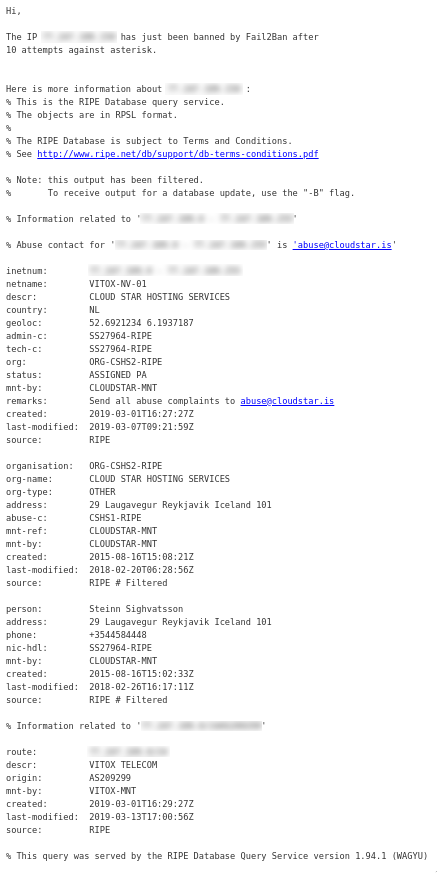

Fundamentals
===============

Verschillende typen hackers
---------------------------

De term “hacker” heeft een heel negatief beeld gekregen in de
samenleving. Dit komt omdat sommige hackers alleen voor eigen gewin gaan
en daarmee anderen beroven. Er is echter ook nog een ander type hacker,
één die wel probeert binnen te komen maar doorgeeft wat er onveilig is.

De hacker die voor eigen gewin gaat en daarmee anderen benadeelt, wordt
een **Black Hat hacker** genoemd. De hacker die beveiligingsfouten
doorgeeft wordt een **White Hat hacker** genoemd. Een White Hat Hacker
die in loondienst werkt, noem je een **Cyber Security Professional**. De
hacker waar je het meest van hoort op het nieuws is de Black Hat.

Een White Hat hacker heeft altijd toestemming van de eigenaar van de
computer waar hij inbreekt. Als een White Hat hacker geen toestemming
heeft, maar wel het lek doorgeeft naderhand wordt hij een **Gray Hat
hacker** genoemd.

Hacken zonder toestemming is altijd illegaal (volgens art. 138a van het
Wetboek v. Strafrecht) en wordt bestraft met maximaal 1 jaar in de
gevangenis of een boete van 20.500€. Soms, als het lek netjes wordt
doorgegeven, wordt het echter door de vingers gezien en wordt er geen
aanklacht gedaan.

Moreel kompas
-------------

Om een goede hacker te zijn heb je ook een goed moreel kompas nodig. Als
je als Black Hat een computer kraakt waar een moord op gepland staat,
zou je dat aangeven bij de politie? Wat als ze vragen hoe je aan dit
bewijs komt? Jij bent immers ook strafbaar voor computervredebreuk. Je staat voor een moreel dilemma

Een goed voorbeeld van een moreel dilemma is de kwestie Edward Snowden. Snowden werkte bij de
CIA en is het gelukt om de NSA (National Security Agency) te kraken. In
2013 werd Snowden aangenomen op freelance basis voor de NSA, waar hij
documenten (staatsgeheimen) bewaarde. Snowden heeft meerdere malen
geprobeerd van binnen de CIA de morele implicaties van sommige operaties
aan te geven, maar niemand luisterde. Op een gegeven moment kon Snowden
er niet meer tegen en vond hij dat hij er wat aan moest doen.

Hij verliet zijn post in Hawaii en vloog naar Hong Kong. Kort daarna
heeft hij aan 3 journalisten de documenten gelekt. Snowden wordt
vervolgd door het Amerikaanse Department of Justice voor spionage en
diefstal van overheidsbezit. Ook hebben ze zijn paspoort ongeldig
verklaard waardoor hij niet meer kan reizen.

Twee dagen hierna is Snowden vertrokken naar Moskou, waar hij meer dan
een maand op het vliegveld heeft ‘gewoond’. De Russische overheid heeft
daarna Snowden asiel geboden met een visum voor 1 jaar. Dit is steeds
verlengd en hij zit nu ergens in Moskou tot 2020 (of langer met nog een
verlenging).

Hacken als filosofie
--------------------

Hoewel de term “hacken” vooral bekend staat als het werkwoord voor
“computerinbraak”, is het eerder een filosofie. Het gaat hier om het
slim omzeilen van limitaties van allerlei soorten computersystemen. Ook is
het de uitdaging om code zo kort en efficiënt mogelijk te schrijven.
Hacken is een manier van doen, niet een werkwoord.

Het aan elkaar plakken van stukken code op een slimme maar onorthodoxe
manier wordt soms ook een hack genoemd en komt ook voort uit deze
filosofie.

Voorbeelden
-----------

Pas als je weet hoe een beveiligingssysteem in elkaar zit en gekraakt
kan worden, kan je jezelf er tegen wapenen.

De eigenaar van een website kan zo op meerdere manieren getroffen
worden. Hack pogingen gebeuren veel vaker dan je zou denken, zelfs al is
je site onbekend. Als een site de beveiliging goed op orde Wanneer er 10
foute inlogpogingen gedaan worden wordt het IP-adres toegang ontzegd
voor 24 uur. Hieronder staat de log melding van de beveiligingssoftware.

In de log melding is ook direct te zien wie je moet bereiken voor een
Abuse melding. Een abuse melding is een serieuze melding dat een
IP-adres zich niet gedraagt online, waarop de internet service provider
(ISP) in contact gaat met de overtreder. Dit is zeker geen lichte
melding en wordt heel serieus genomen.

Links
-----

Kijk hier eens als je nog meer wilt weten:

- [Meer uitleg via Geekflare](https://geekflare.com/understanding-cybersecurity/)
- [Video van ISO (die van de standaarden)](https://www.youtube.com/watch?v=63aQUqYoV9A)
