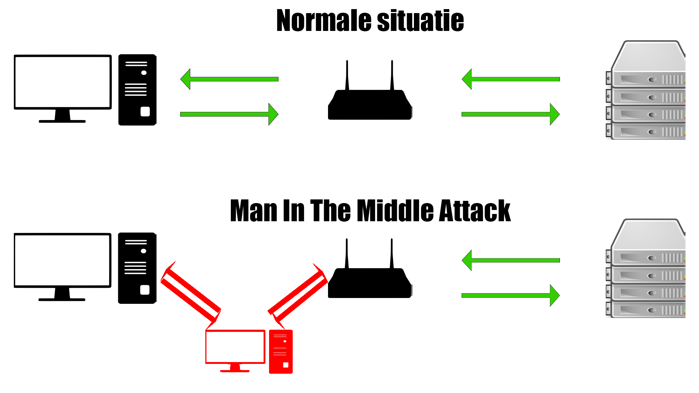

Netwerken en Sniffen
=======================

Voorkennis: {doc}`networking`

Sniffen
-------

De veiligheid van de in ‘Networking’ beschreven buurt is gebaseerd op
vertrouwen. Als er een pakketje wordt bezorgd, wordt er vanuit gegaan
dat dit niet geopend wordt, anders dan door de persoon voor wie het
bestemd is. Er zijn echter altijd mensen die de nieuwsgierigheid niet
kunnen remmen en het pakketje openen voordat jij het zelf doet.

Het bekijken van netwerkverkeer, zonder dat het voor jou bestemd is,
wordt sniffen genoemd. Net als dat je in het echt geen pakketjes van
anderen mag openen, mag dat online ook niet. Dit is dan ook een misdrijf
en zeer strafbaar.

Sniffen is niet mogelijk zonder dat je een router bent. Je moet het
verkeer eerst binnenkrijgen om het te kunnen lezen. Een goede sniffer
zorgt ervoor, dat geen van beide partijen (website en client) weet dat
de data onderschept wordt. Een voorbeeld van een sniffing programma is
Wireshark, dit is tevens het meest bekende programma. Het logo staat
hieronder, misschien heb je die ooit al eens gezien.

Sniffen tegengaan
-----------------

Om sniffen tegen te gaan is er TLS (Transport Layer Security). Dit kan
je zien aan het groene slot bovenin je browser. Hierbij heeft de server
een public key en een private key, maar ook de client. De public key kan
alleen data versleutelen, deze kan dus nooit versleutelde data zichtbaar
maken. De private key kan dit wel. De client versleutelt de data voordat
het verzonden wordt, de data komt versleuteld aan bij de router (die het
niet kan ontsleutelen tenzij hij in bezit is van de private key) en komt
vervolgens veilig aan bij de webserver, waar het zichtbaar gemaakt wordt
en behandeld. De server versleutelt de data dan met de public key van de
client, en zendt het terug. Kijk ook eens naar de module ‘Cryptografie’
als je meer wilt leren over de verschillende sleutels.

Man in the middle
-----------------

Als aanvaller heb je meestal geen toegang tot een centrale router
waarvan je het netwerkverkeer wil sniffen. Om dat op te lossen is de
MITM (Man In The Middle) aanval ontworpen. Hierbij heb je de
‘aanvallende’ computer die constant naar de gebruiker stuurt dat het de
router is, en aan de router dat het de gebruiker is. Als dit succesvol
is, stuurt de gebruiker de data naar de aanvaller, die het vervolgens
doorstuurt naar de echte router en andersom. Nu kan de aanvaller dus WEL
het verkeer onderscheppen en lezen, zonder dat beide partijen dit weten.
TLS beveiliging gaat een MITM aanval ook tegen en maakt dit praktisch
onmogelijk.

Zelf sniffen
---------------------------------

Download en installeer Wireshark op [https://www.wireshark.org/download.html](https://www.wireshark.org/download.html) met de standaardinstellingen.
Download de capture-file op [https://ctf.q-highschool.nl/capture.pcap](https://ctf.q-highschool.nl/capture.pcap)
en open hem met Wireshark. Zoek in dit bestand de vlag.

Links
-----

Kijk hier eens als je nog meer wilt weten:

- [Wireshark in 10 minuten door Vice](https://www.vice.com/en/article/jpgmxp/how-to-go-from-0-to-sniffing-packets-in-10-minutes)
- [Een video tutorial voor Wireshark](https://www.youtube.com/watch?v=9EF44RXD5v0)
