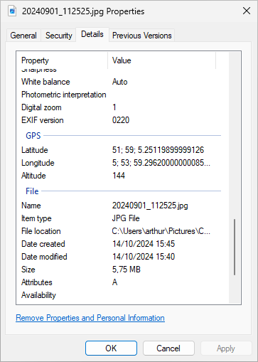

# OSINT

OSINT staat voor *Open Source Intelligence* en gaat over het gebruik van publieke bronnen om aan informatie te komen. Denk bijvoorbeeld aan activiteit op sociale media, advertenties op Marktplaats of zelfs artikelen en foto's in het nieuws. Die informatie kan bijvoorbeeld gebruikt worden om mensen op te sporen. Een foto van je vakantie op een strand in Spanje kan onschuldig lijken, maar laat criminelen ook meteen weten dat je dus niet thuis bent...

Stel nu dat een zekere informatica-docent[^id-github] een foto op een website zet. Bijvoorbeeld deze foto van station Arnhem Centraal. Wat weten we nu over deze persoon? We weten natuurlijk dat die op Arnhem Centraal is geweest, maar we kunnen nog meer uitvinden! Voor wie het station goed kent of een beetje met Google Maps overweg kan, is het nu een koud kunstje om uit te zoeken op welk perron de foto is genomen: gezien de borden en het gebouw op de achtergrond zal dat perron 8 of 9 geweest zijn.

Ook interessant: de bestandsnaam van deze afbeelding. Door de afbeelding te downloaden of te openen in een nieuw tabblad kun je zien dat het bestand nog de originele naam heeft die het van de camera heeft gekregen: *20240901_112525.jpg*, dus we weten nu ook dat de fotograaf op 1 september 2024 om 11:25:25 op perron 8 of 9 van Arnhem Centraal was. Een [archief van treinritten](https://www.rijdendetreinen.nl/treinarchief/2024-09-01/arnhem-centraal) laat zien dat er in het half uur na dat tijdstip drie treinen vertrokken vanaf die perrons, namelijk een sprinter richting Terborg, een intercity naar Nijmegen en de ICE naar Frankfurt. Voor nu loopt ons spoor daar dood, maar wellicht zijn er andere bronnen waarmee deze informatie gecombineerd kan worden om nog meer te weten te komen.

Naast wat we natuurlijk zo op de foto kunnen zien, zit er echter nog meer informatie in een foto verborgen. Met de Windows Verkenner kun je de eigenschappen van het bestand bekijken, bijvoorbeeld de GPS-coördinaten waar de foto genomen is:

Nu zijn de GPS-coördinaten in dit geval niet heel verrassend meer, maar dat is natuurlijk niet voor elke foto het geval. Stel dat het niet een foto van een station was, maar een foto van een kat die lekker op de bank ligt. Dan hadden we met de GPS-coördinaten een goed idee gehad van het huisadres van de fotograaf. Er is echter meer in deze EXIF-metadata te vinden dan alleen GPS-coördinaten: de oplettende lezer weet nu bijvoorbeeld ook wat voor telefoon deze persoon gebruikt.

[^id-github]: En het is niet moeilijk om uit te vinden wie dit geschreven heeft.
